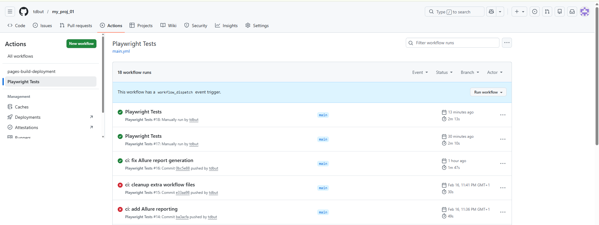
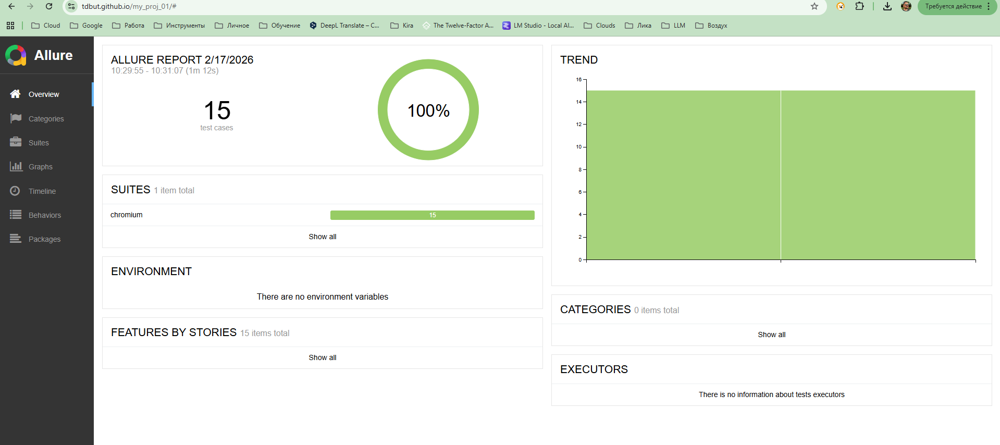
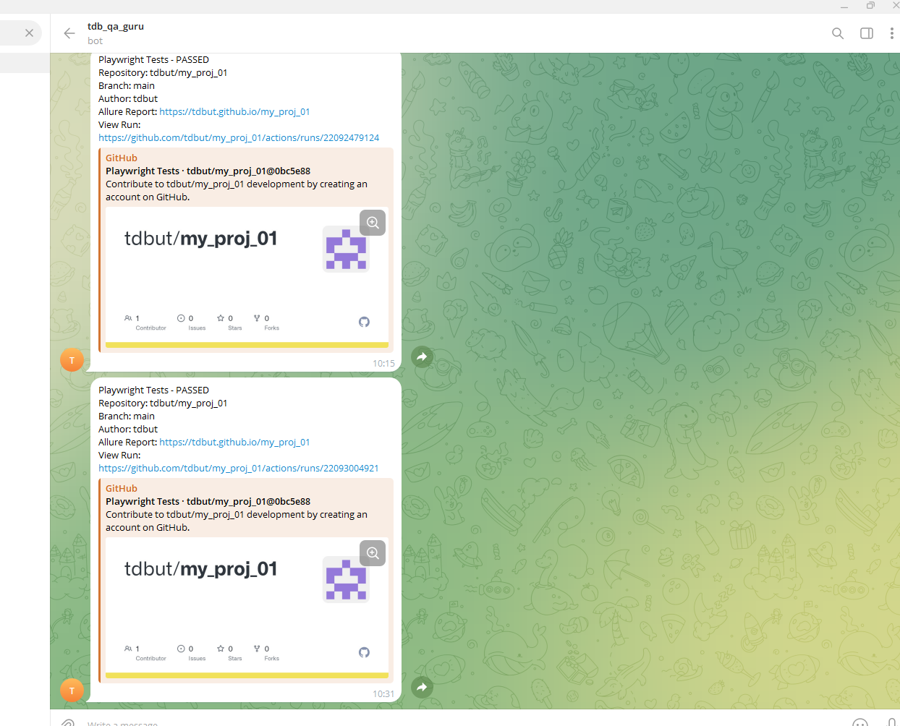

# Playwright Test Project

Учебный проект автоматизации тестирования на Playwright, включающий три независимых тестовых набора: API-тесты, UI-тесты и функциональные тесты с Page Object.

## Содержание

- [Структура проекта](#структура-проекта)
- [Установка и настройка](#установка-и-настройка)
- [Тестовые наборы](#тестовые-наборы)
  - [1. API-тесты — The Cat API](#1-api-тесты--the-cat-api)
  - [2. UI-тесты — DemoWebShop](#2-ui-тесты--demowebshop)
  - [3. Функциональные тесты — RealWorld App](#3-функциональные-тесты--realworld-app)
- [Запуск тестов](#запуск-тестов)
- [Архитектурные решения](#архитектурные-решения)
- [Теги и фильтрация](#теги-и-фильтрация)
- [CI/CD — GitHub Actions](#cicd--github-actions)

## Структура проекта

```
project/
├── .github/
│   └── workflows/
│       └── main.yml               # GitHub Actions workflow (Allure + Telegram)
├── fixtures/
│   ├── api.fixtures.js            # Фикстуры для API-тестов (apiRequest, randomImage, randomBreed)
│   └── ui.fixtures.js             # Фикстуры для UI-тестов (basePage, registerPage, productPage, cartPage)
├── src/
│   ├── helpers/
│   │   ├── data.generator.js    # Генератор данных для API-тестов
│   │   └── ui.data.generator.js # Генератор данных для UI-тестов (регистрация пользователей)
│   └── pages/
│       ├── ui/
│       │   ├── base.page.js     # Header, Navigation, Footer — общие элементы DemoWebShop
│       │   ├── register.page.js # Регистрация пользователей в DemoWebShop
│       │   ├── product.page.js  # Страница товара в DemoWebShop
│       │   └── cart.page.js     # Корзина в DemoWebShop
│       ├── login.page.js        # Авторизация/регистрация в RealWorld
│       ├── home.page.js         # Главная страница RealWorld
│       ├── editor.page.js       # Редактор статей RealWorld
│       ├── article.page.js      # Страница статьи RealWorld
│       └── settings.page.js     # Настройки профиля RealWorld
├── tests/
│   ├── api.spec.js              # API-тесты The Cat API
│   ├── uiTests.spec.js          # UI-тесты DemoWebShop
│   └── page.object.tests.spec.js # Функциональные тесты RealWorld
└── playwright.config.js
├── screenshots/                   # Скриншоты для README
│   ├── allure-report.png
│   ├── allure-testops.png
│   ├── github-actions.png
│   └── telegram.png
```

## Установка и настройка

```bash
# Установка зависимостей
npm install

# Установка браузеров Playwright
npx playwright install
```

## Тестовые наборы

### 1. API-тесты — The Cat API

**URL:** `https://api.thecatapi.com/v1`

Тесты REST API с использованием кастомных фикстур (`api.fixtures.js`). Каждый тест работает через объект `apiRequest`, инкапсулирующий HTTP-запросы.

| Тест | Метод | Endpoint | Описание |
|------|-------|----------|----------|
| Получить случайные изображения | GET | `/images/search` | Поиск изображений с параметром `limit`, валидация URL-формата |
| Получить список пород | GET | `/breeds` | Полный список пород, проверка уникальности ID |
| Получить изображение по ID | GET | `/images/{id}` | Получение конкретного изображения (фикстура `randomImage`) |
| Поиск по породе с пагинацией | GET | `/images/search` | Фильтрация по `breed_ids`, параметры `limit` и `page` |
| Несуществующее изображение | GET | `/images/{id}` | Негативный тест — ожидается 400 или 404 |

**Фикстуры:**
- `apiRequest` — HTTP-клиент с методами `searchImages()`, `getBreeds()`, `getImageById()`
- `randomImage` — случайное изображение, полученное перед тестом
- `randomBreed` — случайная порода для параметризации

**Теги:** `@smoke`, `@api`, `@GET`, `@images`, `@breeds`, `@negative`

### 2. UI-тесты — DemoWebShop

**URL:** `https://demowebshop.tricentis.com`

Тесты проверяют наличие и корректность UI-компонентов на страницах интернет-магазина. Перед каждым тестом выполняется регистрация нового пользователя через `registerPage.register()`.

| Тест | Что проверяется |
|------|----------------|
| Проверка элементов хедера | Логотип (атрибут `alt`), поле поиска (атрибут `value`), кнопка поиска, ссылка на корзину, кнопка Logout |
| Проверка страницы товара | Название, цена, кнопка Add to cart (`getAttribute('value')`), кнопка Add to wishlist |
| Проверка элементов корзины | Заголовок, таблица товаров (`getByRole('table')`), заголовки колонок, чекбокс удаления, кнопки Update и Checkout |
| Проверка навигации | Верхнее меню — 7 категорий с корректными `href` |
| Проверка футера | 4 блока (Information, Customer service, My account, Follow us) через `getByRole('heading', { level: 3 })`, ссылки, социальные иконки |

**Page Objects:**
- `BasePage` — header, navigation, footer; методы `verifyHeaderLogo()`, `verifySearchBox()`, `getCategoryLinks()`, `getFooterLinks()`
- `RegisterPage` — форма регистрации, метод `register(userData)`
- `ProductPage` — карточка товара; `verifyProductName()`, `verifyProductPrice()`, `addToCart()`
- `CartPage` — корзина; `verifyCartTable()`, `verifyTableHeaders()`, `verifyCheckoutButton()`

**Теги:** `@ui`, `@components`, `@header`, `@product`, `@cart`, `@navigation`, `@footer`

### 3. Функциональные тесты — RealWorld App

**URL:** RealWorld (Conduit) — демо-приложение для блогов

E2E-тесты пользовательских сценариев. Перед каждым тестом регистрируется новый пользователь с уникальным email (`user{timestamp}@test.com`).

| Тест | Сценарий |
|------|----------|
| Создание статьи | New Article → заполнение формы → Publish → проверка заголовка |
| Добавление комментария | Создание статьи → ввод комментария → проверка отображения |
| Редактирование профиля | Settings → обновление Bio → Save → проверка значения |
| Лайк статьи | Создание статьи → Global Feed → клик Like → проверка класса `active` |
| Редактирование статьи | Создание → Edit → изменение заголовка → Update → проверка |

**Page Objects:**
- `LoginPage` — `register(name, email, pass)`
- `HomePage` — `clickNewArticle()`, `clickSettings()`, `clickGlobalFeed()`, `clickLike()`
- `EditorPage` — `fillArticle(title, description, body)`, `publish()`, `update()`
- `ArticlePage` — `addComment(text)`, `editArticle()`
- `SettingsPage` — `updateBio(text)`, `saveSettings()`

## Запуск тестов

```bash
# Все тесты
npx playwright test

# По файлу
npx playwright test tests/api.spec.js
npx playwright test tests/uiTests.spec.js
npx playwright test tests/page.object.tests.spec.js

# По тегу
npx playwright test --grep @smoke
npx playwright test --grep @api
npx playwright test --grep @ui
npx playwright test --grep @header

# Комбинация тегов
npx playwright test --grep "@ui.*@footer"

# С UI-отчётом
npx playwright test --reporter=html
npx playwright show-report
```

## Архитектурные решения

**Паттерн Page Object** — каждая страница представлена классом с локаторами в конструкторе и методами взаимодействия. Локаторы определяются один раз и переиспользуются во всех тестах.

**Кастомные фикстуры** (`test.extend()`) — page object'ы инжектируются в тесты как фикстуры, что позволяет избежать повторного создания объектов и обеспечивает единую точку конфигурации.

**Role-based локаторы** — в UI-тестах вместо угадывания CSS-классов используются `getByRole()` и `.filter({ has: ... })`, что делает тесты устойчивыми к изменениям вёрстки.

**Генерация тестовых данных** — каждый тест создаёт уникального пользователя через `Date.now()` + `Math.random()`, что обеспечивает изоляцию и параллельный запуск.

**Явные ожидания** — `waitForLoadState('domcontentloaded')` после навигации, `waitFor({ state: 'visible' })` перед кликами — без `waitForTimeout()`.

## Теги и фильтрация

| Тег | Область |
|-----|---------|
| `@smoke` | Критичные API-тесты |
| `@api` | Все API-тесты |
| `@GET` | GET-запросы |
| `@images` | Тесты изображений |
| `@breeds` | Тесты пород |
| `@negative` | Негативные сценарии |
| `@ui` | Все UI-тесты |
| `@components` | Проверка компонентов |
| `@header` | Хедер |
| `@product` | Страница товара |
| `@cart` | Корзина |
| `@navigation` | Навигация |
| `@footer` | Футер |

## CI/CD — GitHub Actions

Тесты запускаются автоматически через GitHub Actions при push в `main`/`develop` и при pull request.

### Что делает workflow

```
push/PR → checkout → Node.js 20 → npm ci → install Chromium
        → API tests → UI tests → Page Object tests
        → Allure Report → GitHub Pages → Allure TestOps
        → Telegram notification
```

Каждый тестовый набор запускается отдельным шагом с `continue-on-error: true`, чтобы падение одного набора не блокировало выполнение остальных.

### GitHub Actions — результаты прогонов

<p align="center">
  
</p>

### Allure Report (GitHub Pages)

Отчёт публикуется на GitHub Pages с сохранением истории запусков: https://tdbut.github.io/my_proj_01/

<p align="center">
  
</p>

- 15 тестов, 100% passed
- Тренды прогонов (графики справа)
- Suites, Timeline, Behaviors, Graphs

### Allure TestOps

Результаты автоматически загружаются в [Allure TestOps](https://allure.autotests.cloud) через `allurectl`. Тест-кейсы создаются из автотестов, запуски привязываются к CI.

<p align="center">
  
</p>

- 15 активных тест-кейсов
- 100% автоматизация
- Дашборд с трендами запусков

### Telegram-уведомления

После каждого прогона бот отправляет уведомление со статусом и ссылками на Allure Report и GitHub Actions.

<p align="center">
  
</p>

### Как запустить вручную

1. Перейти в **Actions** → **Playwright Tests**
2. Нажать **Run workflow**
3. Выбрать ветку → **Run workflow**

### Secrets (Settings → Secrets → Actions)

| Secret | Описание |
|--------|----------|
| `TELEGRAM_BOT_TOKEN` | Токен Telegram-бота от @BotFather |
| `TELEGRAM_CHAT_ID` | Chat ID для уведомлений |
| `ALLURE_TESTOPS_URL` | `https://allure.autotests.cloud` |
| `ALLURE_TESTOPS_TOKEN` | API-токен Allure TestOps |
| `ALLURE_TESTOPS_PROJECT_ID` | ID проекта в Allure TestOps |
